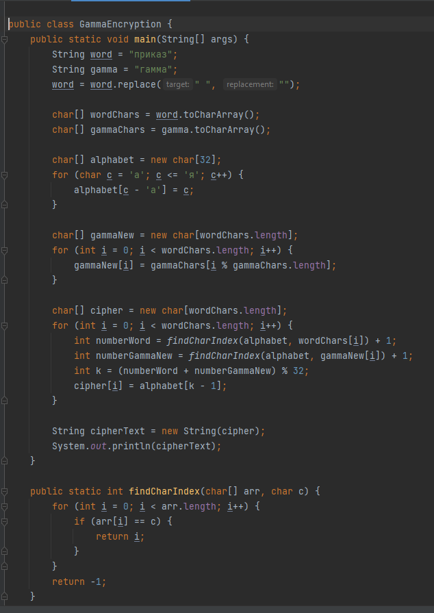

---
## Front matter
title: "Лабораторная работа 3"
subtitle: "Математические основы защиты информации и информационной безопасности"
author: "Минов Кирилл Вячеславович | НПМмд-02-23"

## Generic otions
lang: ru-RU
toc-title: "Содержание"

## Bibliography
bibliography: bib/cite.bib
csl: pandoc/csl/gost-r-7-0-5-2008-numeric.csl

## Pdf output format
toc: true # Table of contents
toc-depth: 2
lof: true # List of figures
lot: true # List of tables
fontsize: 12pt
linestretch: 1.5
papersize: a4
documentclass: scrreprt
## I18n polyglossia
polyglossia-lang:
  name: russian
  options:
	- spelling=modern
	- babelshorthands=true
polyglossia-otherlangs:
  name: english
## I18n babel
babel-lang: russian
babel-otherlangs: english
## Fonts
mainfont: PT Serif
romanfont: PT Serif
sansfont: PT Sans
monofont: PT Mono
mainfontoptions: Ligatures=TeX
romanfontoptions: Ligatures=TeX
sansfontoptions: Ligatures=TeX,Scale=MatchLowercase
monofontoptions: Scale=MatchLowercase,Scale=0.9
## Biblatex
biblatex: true
biblio-style: "gost-numeric"
biblatexoptions:
  - parentracker=true
  - backend=biber
  - hyperref=auto
  - language=auto
  - autolang=other*
  - citestyle=gost-numeric
## Pandoc-crossref LaTeX customization
figureTitle: "Рис."
tableTitle: "Таблица"
listingTitle: "Листинг"
lofTitle: "Список иллюстраций"
lotTitle: "Список таблиц"
lolTitle: "Листинги"
## Misc options
indent: true
header-includes:
  - \usepackage{indentfirst}
  - \usepackage{float} # keep figures where there are in the text
  - \floatplacement{figure}{H} # keep figures where there are in the text
---

# Цель работы

Реализовать на языке программирования шифрование гаммированием конечной гаммой.

# Теоретическое введение

Гаммирование - процедура наложения при помощи некоторой функции F на исходный текст гаммы шифра, то есть псевдослучайной последовательности (ПСП) с выходов генератора G. 
ПСП по своим статистическим свойствам неотличима от случайной последовательности, но является детерминированной, то есть известен алгоритм ее формирования. 
Чаще всего в качестве функции F берется операция поразрядного сложения по модулю два или по модулю N (N - число букв алфавита открытого текста).

Стойкость шифров, основанных на процедуре гаммирования, зависит от характеристик гаммы - длины и равномерности распределения вероятностей появления знаков гаммы.

# Выполнение лабораторной работы
1)Импорт библиотек и объявление переменных: В этом шаге мы начинаем программу, импортируем необходимые библиотеки и объявляем переменные для открытого текста и ключа.

2)Преобразование строк в массивы символов: Мы преобразуем строки с открытым текстом и ключом в массивы символов (char arrays) для удобной работы с отдельными символами.

3)Создание алфавита: Мы создаем массив символов, представляющий собой русский алфавит, включающий буквы от 'а' до 'я'.

4)Создание нового ключа: Мы создаем новый ключ (gammaNew), который будет использоваться для шифрования. Этот ключ повторяет символы из исходного ключа (gamma) так, чтобы его длина совпадала с длиной открытого текста (word).

5)Шифрование открытого текста: На этом этапе каждый символ открытого текста преобразуется в шифрованный символ. Для этого:
Находим позиции символов в алфавите.
Добавляем 1 к этим позициям (позиции начинаются с 0).
Складываем позиции символов открытого текста и соответствующего символа из ключа.
Результат делится по модулю на 32 (размер алфавита).
Результат вычитается 1, чтобы получить шифрованный символ.
Зашифрованные символы добавляются в массив cipher.
6)Вывод зашифрованного текста: Зашифрованные символы объединяются в строку, и эта строка выводится на экран.

{ }

# Выводы

В ходе выполнения данной лабораторной работы было реализовано шифрование гаммированием конечной гаммой на языке программирования Java.
