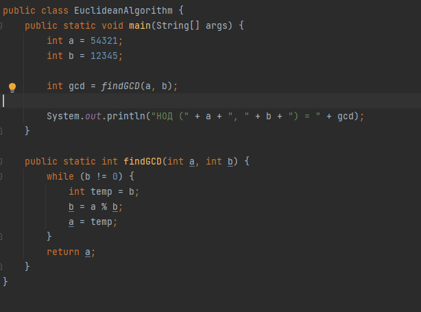
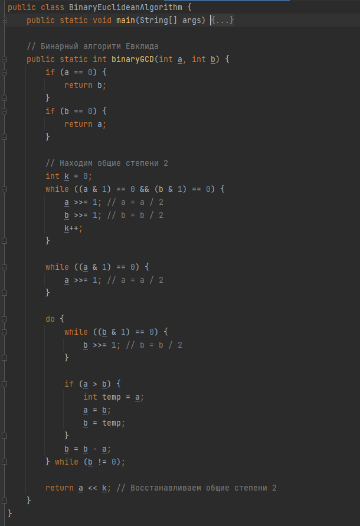
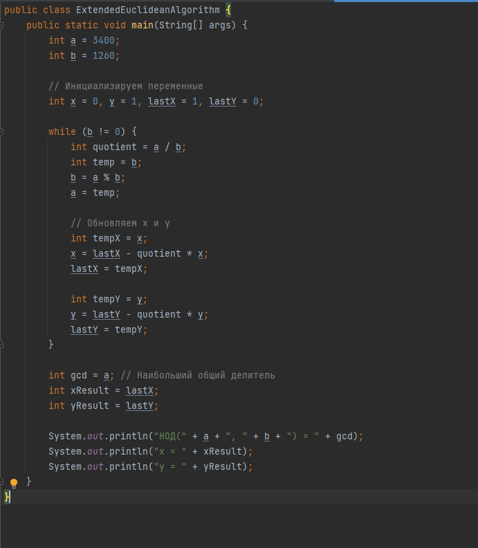
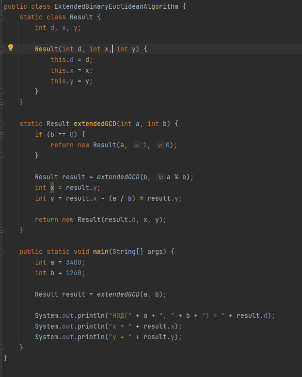

---
## Front matter
lang: ru-RU
title: Лабораторная работа №4
subtitle: Математические основы защиты информации и информационной безопасности
author:
  - Минов К.В., НПМмд-02-23
institute:
  - Российский университет дружбы народов
  - Москва, Россия
date: 27 октября 2023

## i18n babel
babel-lang: russian
babel-otherlangs: english

## Formatting pdf
toc: false
toc-title: Содержание
slide_level: 2
aspectratio: 169
section-titles: true
theme: metropolis
header-includes:
 - \metroset{progressbar=frametitle,sectionpage=progressbar,numbering=fraction}
 - '\makeatletter'
 - '\beamer@ignorenonframefalse'
 - '\makeatother'
---

## Цель лабораторной работы

Реализовать на языке программирования алгоритмы Евклида для вычисления наибольшего общего делителя

## Теоретическое введение

Целое число d != 0 называется наибольшим общим делителем целых чисел a1,a2,...,ak (обозначается НОД $(a_1, a_2, ..., a_k)$), если выполняются следующие условия: 1)каждое из чисел a1,a2,...,ak делится на d 2)если d1 != 0 - другой общий делитель чисел a1,a2,...,ak то d делится на d1

Для вычисления наибольшего общего делителя двух целых чисел применяется способ повторного деления с остатком, называемый алгоритмом Евклида.

## Ход выполнения лабораторной работы

Реализуем алгоритм Евклида

{ }

## Ход выполнения лабораторной работы

Реализуем бинарный алгоритм Евклида

{ }

## Ход выполнения лабораторной работы

Реализуем расширенный алгоритм Евклида

{ }

## Ход выполнения лабораторной работы

Реализуем расширенный бинарный алгоритм Евклида

{ }

## Вывод

В ходе выполнения данной лабораторной работы были реализованы алгоритмы Евклида для вычисления наибольшего общего делителя
