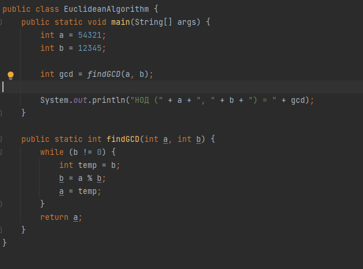
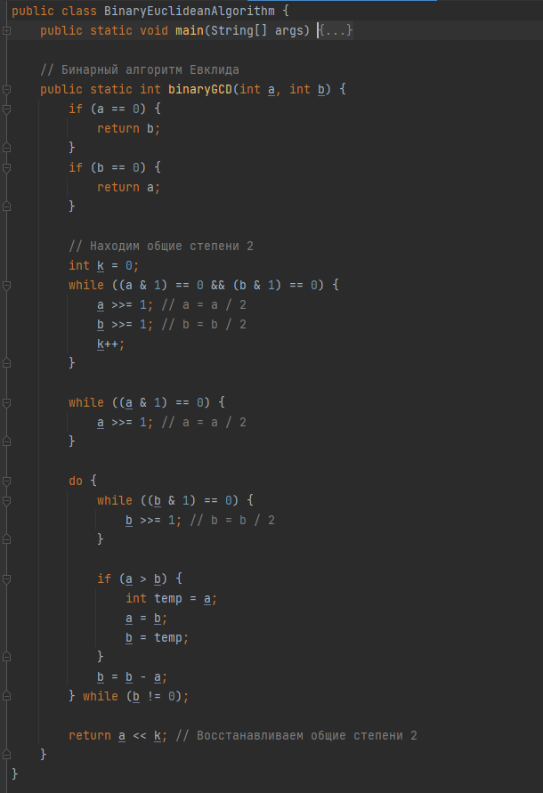
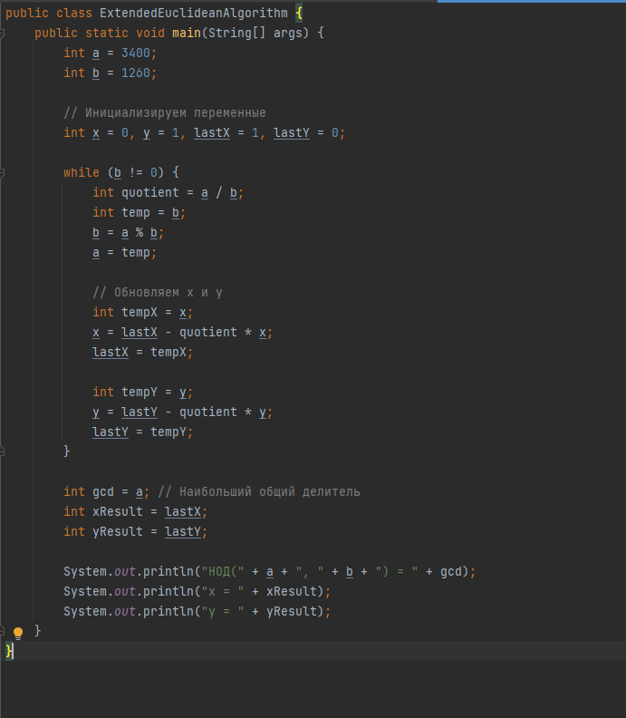
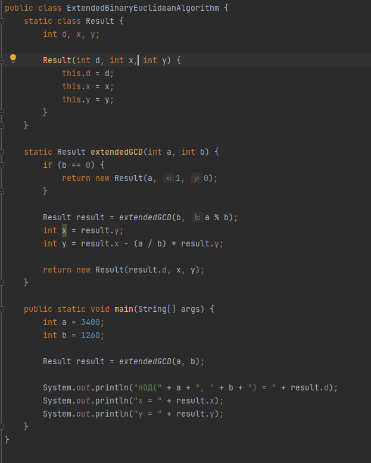

---
## Front matter
title: "Лабораторная работа 4"
subtitle: "Математические основы защиты информации и информационной безопасности"
author: "Минов Кирилл Вячеславович | НПМмд-02-23"

## Generic otions
lang: ru-RU
toc-title: "Содержание"

## Bibliography
bibliography: bib/cite.bib
csl: pandoc/csl/gost-r-7-0-5-2008-numeric.csl

## Pdf output format
toc: true # Table of contents
toc-depth: 2
lof: true # List of figures
lot: true # List of tables
fontsize: 12pt
linestretch: 1.5
papersize: a4
documentclass: scrreprt
## I18n polyglossia
polyglossia-lang:
  name: russian
  options:
	- spelling=modern
	- babelshorthands=true
polyglossia-otherlangs:
  name: english
## I18n babel
babel-lang: russian
babel-otherlangs: english
## Fonts
mainfont: PT Serif
romanfont: PT Serif
sansfont: PT Sans
monofont: PT Mono
mainfontoptions: Ligatures=TeX
romanfontoptions: Ligatures=TeX
sansfontoptions: Ligatures=TeX,Scale=MatchLowercase
monofontoptions: Scale=MatchLowercase,Scale=0.9
## Biblatex
biblatex: true
biblio-style: "gost-numeric"
biblatexoptions:
  - parentracker=true
  - backend=biber
  - hyperref=auto
  - language=auto
  - autolang=other*
  - citestyle=gost-numeric
## Pandoc-crossref LaTeX customization
figureTitle: "Рис."
tableTitle: "Таблица"
listingTitle: "Листинг"
lofTitle: "Список иллюстраций"
lotTitle: "Список таблиц"
lolTitle: "Листинги"
## Misc options
indent: true
header-includes:
  - \usepackage{indentfirst}
  - \usepackage{float} # keep figures where there are in the text
  - \floatplacement{figure}{H} # keep figures where there are in the text
---

# Цель работы

Реализовать на языке программирования алгоритмы Евклида для вычисления наибольшего общего делителя.

# Теоретическое введение

Целое число d != 0 называется наибольшим общим делителем целых чисел a1,a2,...,ak (обозначается НОД $(a_1, a_2, ..., a_k)$), если выполняются следующие условия:
1)каждое из чисел a1,a2,...,ak делится на d
2)если d1 != 0 - другой общий делитель чисел a1,a2,...,ak то d делится на d1

Для вычисления наибольшего общего делителя двух целых чисел применяется способ повторного деления с остатком, называемый алгоритмом Евклида.

# Выполнение лабораторной работы

1)Алгоритм Евклида
Начнем с двух целых чисел, a и b, для которых мы хотим найти НОД.

В цикле, пока b не станет равно нулю, мы выполняем следующие шаги:

1. Создаем временную переменную temp и присваиваем ей значение b.
2. Обновляем b как остаток от деления a на temp. Это шаг разделения чисел на остатки.
3. Затем обновляем a значением temp.

Когда b становится равным нулю, цикл завершается, и a будет содержать НОД исходных чисел a и b.

{ #fig:004 width=75% }

2)Бинарный алгоритм Евклида

В методе main вводятся два целых числа num1 и num2, для которых нужно найти НОД.
Метод binaryGCD принимает два целых числа a и b и возвращает их НОД с использованием бинарного алгоритма Евклида.
Если a равно 0, то возвращается b, и наоборот. Это базовый случай для рекурсии.
Затем в цикле выполняется нахождение общих степеней 2 в a и b, путем сдвига вправо (двоичное деление) до тех пор, пока оба числа не станут нечетными.
Одновременно увеличивается счетчик k для восстановления общих степеней 2.
Затем продолжается вычисление НОД путем вычитания меньшего числа из большего числа до тех пор, пока одно из чисел не станет равным 0.
В конечном итоге возвращается результат a << k, что эквивалентно умножению a на 2 в степени k. Это восстанавливает общие степени 2, которые были учтены в начале алгоритма для более эффективных вычислений.

{ #fig:004 width=75% }

3)Расширенный алгоритм Евклида

Исходные числа a и b задаются в начале.
Затем инициализируются переменные x и y, которые будут использоваться для нахождения коэффициентов x и y уравнения. Также создаются переменные lastX и lastY для хранения предыдущих значений x и y.
Запускается цикл while, который продолжает выполняться, пока b не станет равным 0. Внутри цикла выполняются операции алгоритма Евклида:
Вычисляется частное от деления a на b и сохраняется в quotient.
Затем выполняется обмен значениями a и b так, чтобы b стало равным остатку от деления a на b.
Обновляются значения x и y в соответствии с алгоритмом.
Когда b становится равным 0, цикл завершается, и программа выводит результаты:
Наибольший общий делитель НОД(a, b) хранится в gcd.
Коэффициенты x и y, удовлетворяющие уравнению ax + by = НОД(a, b), хранятся в xResult и yResult.

{ #fig:004 width=75% }

4)Расширенный бинарный алгоритм Евклида

Внутренний класс Result используется для удобного хранения результатов алгоритма. Он содержит три поля: d (НОД), x и y, которые представляют коэффициенты, удовлетворяющие уравнению.
Метод extendedGCD(int a, int b) реализует алгоритм. Этот метод является рекурсивным и работает следующим образом:
Если b равно 0, то алгоритм завершает выполнение, так как НОД a и 0 равен a. В этом случае метод возвращает результат с d = a, x = 1, и y = 0.
В противном случае, алгоритм вызывает себя с b вместо a, а остаток от деления a на b вместо b.
Затем вычисляются новые значения x и y, используя результат предыдущего вызова. Эти значения удовлетворяют уравнению ax + by = НОД(a, b). 
Эти вычисления выполняются обратно от нижних вызовов к верхнему уровню рекурсии.
В методе main создается объект класса  ExtendedBinaryEuclideanAlgorithm, и метод extendedGCD вызывается для заданных чисел a и b.

Результат выполнения алгоритма, включая НОД a и b, а также значения x и y, выводится на экран.

{ #fig:004 width=75% }

# Выводы

В ходе выполнения данной лабораторной работы были реализованы алгоритмы Евклида для вычисления наибольшего общего делителя.

