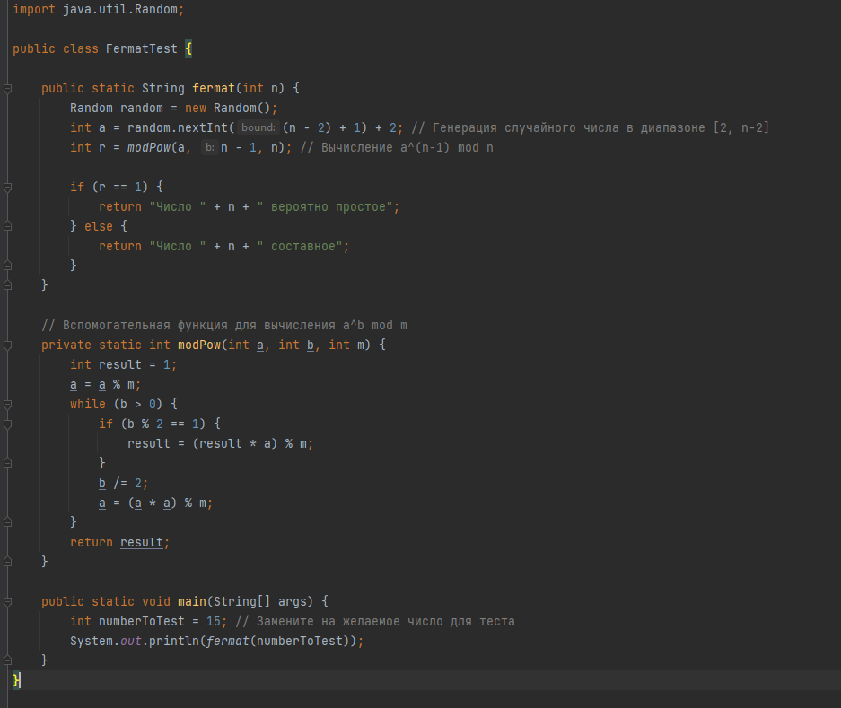
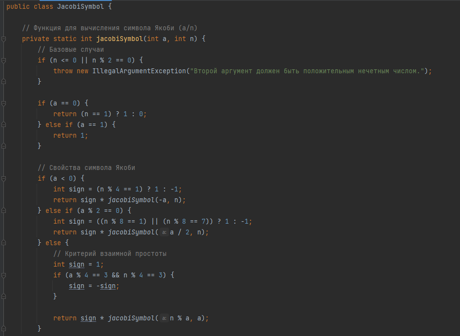

---
## Front matter
lang: ru-RU
title: Лабораторная работа №5
subtitle: Математические основы защиты информации и информационной безопасности
author:
  - Минов К.В., НПМмд-02-23
institute:
  - Российский университет дружбы народов
  - Москва, Россия
date: 27 октября 2023

## i18n babel
babel-lang: russian
babel-otherlangs: english

## Formatting pdf
toc: false
toc-title: Содержание
slide_level: 2
aspectratio: 169
section-titles: true
theme: metropolis
header-includes:
 - \metroset{progressbar=frametitle,sectionpage=progressbar,numbering=fraction}
 - '\makeatletter'
 - '\beamer@ignorenonframefalse'
 - '\makeatother'
---

## Цель лабораторной работы

Реализовать на языке программирования вероятностные алгоритмы проверки чисел на простоту

## Теоретическое введение

Детерминированный алгоритм всегда действует по одной и той же схеме и гарантированно решает поставленную задачу (или не дает никакого ответа).

Вероятностный алгоритм использует генератор случайных чисел и дает не гарантированно точный ответ. Вероятностные алгоритмы в общем случае не менее эффективны, чем детерминированные (если используемый генератор случайных чисел всегда дает набор одних и тех же чисел, зависящих от входных данных, то вероятностный алгоритм становится детерминированным).

## Ход выполнения лабораторной работы

Реализуем тест Ферма

Реализуем вычисление символа Якоби

Реализуем тест Соловэя-Штрассена

.PNG)
.PNG)
.PNG)

Реализуем тест Миллера-Рабина

.PNG)
.PNG)

## Вывод

В ходе выполнения данной лабораторной работы были реализованы вероятностные алгоритмы проверки чисел на простоту

